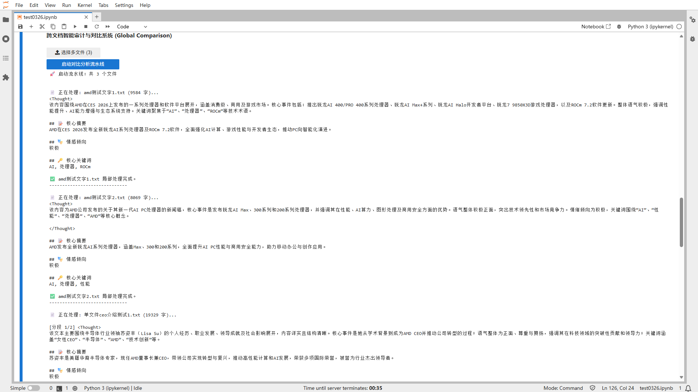
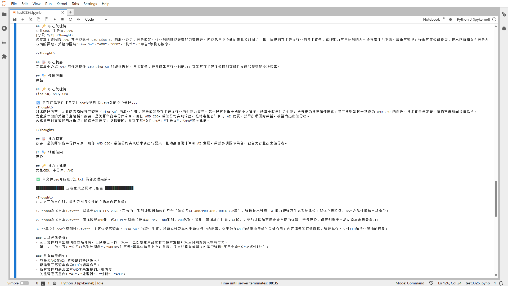
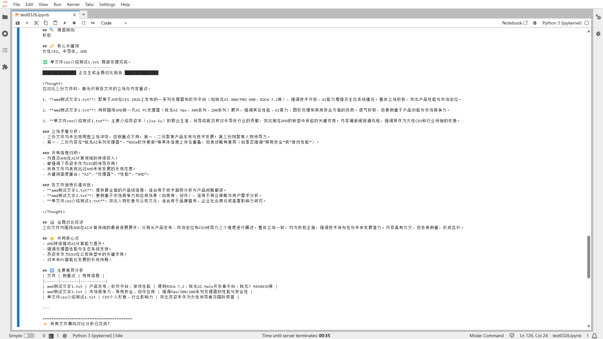

# 跨文档智能审计与对比系统

[English Version](./README.md)

## 项目简介

本项目是一个基于 Ollama (Qwen3-Coder:30B) 的自动化文档处理流水线，旨在解决长文档分析难、多文档对比慢的问题。它通过滑动窗口技术处理超长文本，并能自动生成单文件摘要及多文件间的横向对比审计报告。

## 活动信息

- **比赛 / 工作坊：** 2026 南邮寒假大作战
- **获奖情况：** 优秀奖

## 运行环境

- **基础镜像：** Basic GPU Environment（aup-learning-cloud）
- **额外依赖：** 无

## 快速开始

1. 在 aup-learning-cloud 中选择 **Basic GPU Environment**，Git URL 填写本仓库地址
2. 进入 `cases/<活动文件夹>/<你的文件夹>/`
3. 打开 `main_zh.ipynb`（中文版）或 `main.ipynb`（英文版）
4. 从头到尾运行所有 Cell

## 技术亮点

- 级联式处理架构：采用“分段分析 -> 文件汇总 -> 全局对比”的三级串联逻辑，有效突破 LLM 的上下文窗口限制。
- 智能重叠窗口 (Sliding Window)：设置 $15,000$ 字符块与 $500$ 字符重叠区，确保长文本在切片处理时语义不丢失。
- 异步流式交互：基于 httpx 异步库与 ipywidgets 实现流式文本渲染，无需等待模型全部生成即可实时查看推理思考过程（Thought Chain）。
- 零温采样控制：设置 temperature: 0.0，确保审计类任务的严谨性与结果可复现性。

## 结果 / 演示

*对这些文本，在网页上按 Ctrl+A，然后复制到 .txt 文件中进行测试。下面是测试结果的图片。*

**演示图片**
- 
- 
- 

**引用资源**
- https://baike.baidu.com/item/%E8%8B%8F%E5%A7%BF%E4%B8%B0
- https://zh.wikipedia.org/wiki/Lisa_Su
- https://www.amd.com/zh-cn/newsroom/press-releases/2025-1-6-amd-announces-expanded-consumer-and-commercial-ai-.html
- https://www.amd.com/zh-cn/newsroom/press-releases/2026-1-5-amd-expands-ai-leadership-across-client-graphics-.html

## 参考资料

- 模型：Qwen3-Coder-30B (via Ollama)
- 工具库：Httpx, IPyWidgets